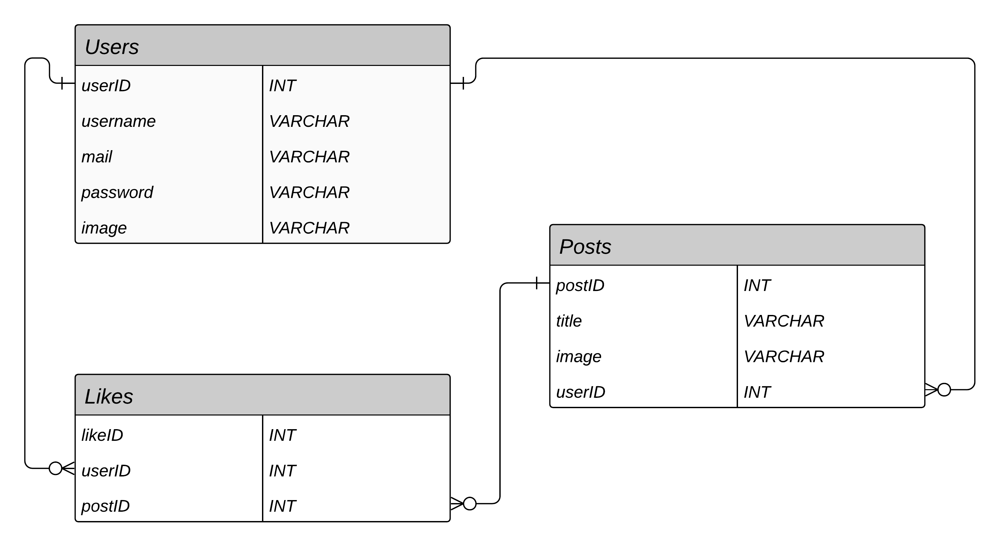
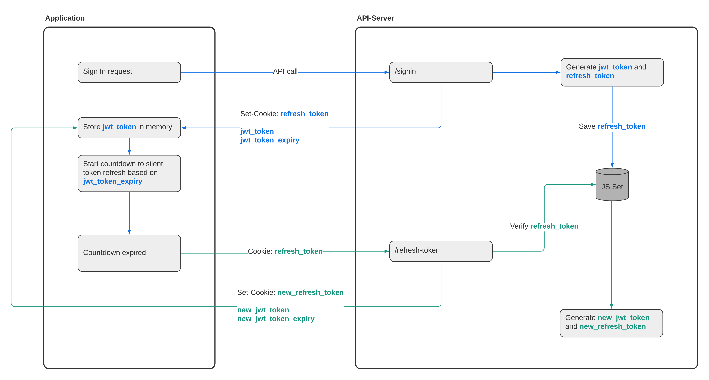

# Image gallery with React, RESTful, MySQL #

HSLU Digital Ideation - HS2020

Mentoring (5. Semester)

## Usage ##

### Frontend ###

#### `npm start` ####

Runs the app in development mode.<br>
Open [http://localhost:3000](http://localhost:3000) to view it in the browser.

The page will automatically reload if you make changes to the code.<br>
You will see the build errors and lint warnings in the console.

#### `npm run build` ####

Builds the app for production to the `build` folder.<br>
It correctly bundles React in production mode and optimizes the build for the best performance.

The build is minified and the filenames include the hashes.

Your app is ready to be deployed.

### Backend ###

#### `npm start` ####

Runs the API server on [http://localhost:8080](http://localhost:8080).

The server will automatically restart if you make changes to the code.

### Environment variables ###

Create a .env file to save the required environment variables.

```shell
API_PORT=<api-port>

DB_HOST=<db-host>
DB_USER=<db-user>
DB_PASSWORD=<db-password>
DB_PORT=<db-port>
DB_NAME=<db-name>

JWT_SECRET=<jwt-secret>
JWT_EXPIRY=<jwt-expiry>
JWT_REFRESH_SECRET=<jwt-refresh-secret>
JWT_REFRESH_EXPIRY=<jwt-refresh-expiry>
```

## User Interface ##


## Frontend Architecture ##

### Tech Stack ###

[`React`](https://reactjs.org/) - Javascript Library

[`React Router`](https://reactrouter.com/) - React Routing Library

[`axios`](https://github.com/axios/axios) - Promise based HTTP client

[`validator.js`](https://github.com/validatorjs/validator.js) - Library for input validation and sanitization

[`Sass`](https://sass-lang.com/) - CSS extension language

## Backend  Architecture ##

### Tech Stack ###

[`Express`](https://expressjs.com/) - Node.js web framework

[`express-validator`](https://github.com/express-validator/express-validator) - Set of express.js middlewares wrapping validator.js functions

[`bcrypt`](https://github.com/kelektiv/node.bcrypt.js#readme) - Password hashing library

[`jsonwebtoken`](https://github.com/auth0/node-jsonwebtoken#readme) - JWT implementation for Node.js

[`promise-mysql`](https://github.com/CodeFoodPixels/node-promise-mysql#readme) - Promisified Node.js driver for mysql

[`multer`](https://github.com/expressjs/multer) - express.js middleware handling multipart/form-data

[`sharp`](https://github.com/lovell/sharp) - Node.js image converter module

### Swagger Documentation ###

Look up the API documentation on SwaggerHub:

[Swagger API documentation](https://app.swaggerhub.com/apis/fabjeck/restful-gallery/1.0.0)

### Entity Relationship Diagram (ERD) ###



## Authentification ##

The authentification mechanism was implemented based on the following detailed and comprehensible [JWT handling guide](https://hasura.io/blog/best-practices-of-using-jwt-with-graphql/#jwt_security).



### Implementation hurdle ###

 The required Cookie header – containing the refresh token – isn't attached to the `/refresh-token` api call without [trickery](https://stackoverflow.com/a/489396), due to the browser considering localhost as an invalid domain. Thereby user sessions are not persisted.

>Per default a HTTP-Cookie is only available from the subdomain, which recieved it, unless specified differently within the domain attribute.

[More infos on HTTP cookies](https://developer.mozilla.org/en-US/docs/Web/HTTP/Cookies)
